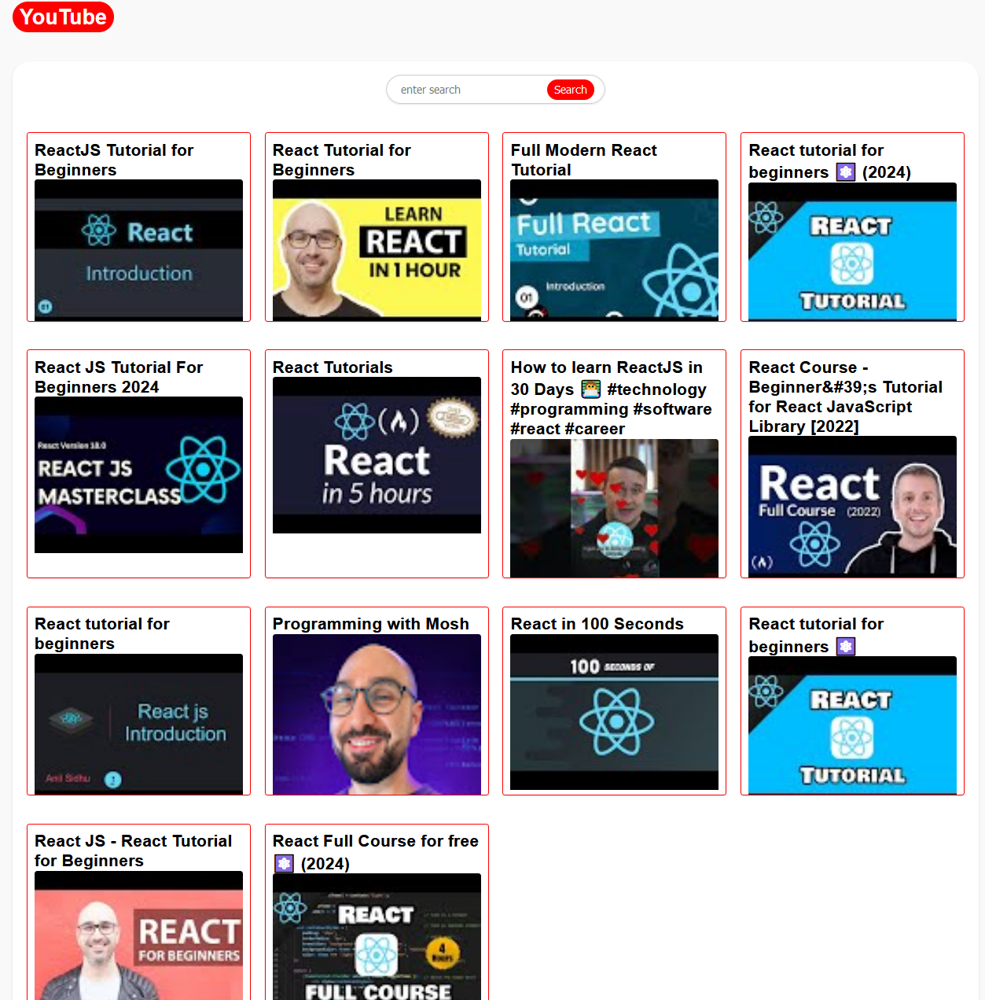

# YouTube Clone Project

## Objective
The objective of this project is to create a simplified version of YouTube. This is a web application that emulates key functionalities of YouTube, focusing on video browsing, searching, and viewing. This project is designed for educational purposes and to showcase the implementation of a simple video streaming service via the YouTube API.

## Getting Started

1. **Fork the Repository**: Click the 'Fork' button at the top right of this page to create a copy of this repository in your GitHub account.
2. **Clone Your Forked Repository**: Clone the repository to your local machine using the `git clone` command with your repository's URL.
3. **Navigate to Your Project Folder**: Change your directory to the folder where you cloned the repo.
4. **Install Dependencies**: Run `npm install` to install the necessary dependencies for the project.

## Features
The application currently consists of three main features:

- **Viewing Videos**: On the Index Route, you can view a list of popular or predefined videos.
- **Searching for Videos**: Use the Search Bar to find videos. The search results will be displayed on the Search Route.
- **Watching a Video**: Click on any video in the Video List to watch it. The Video Player will open on the Video Route, where you can view the video and its details.

## Usage
- **Viewing Videos**: On the Index Route, you can view a list of popular or predefined videos.

- **Searching for Videos**: Use the Search Bar to find videos. The search results will be displayed on the Search Route.

- **Watching a Video**: Click on any video in the Video List to watch it. The Video Player will open on the Video Route, where you can view the video and its details.

