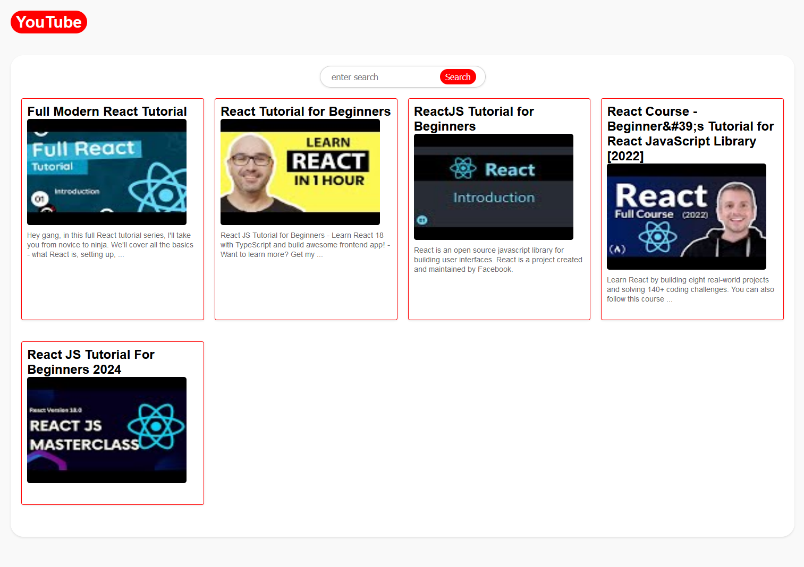
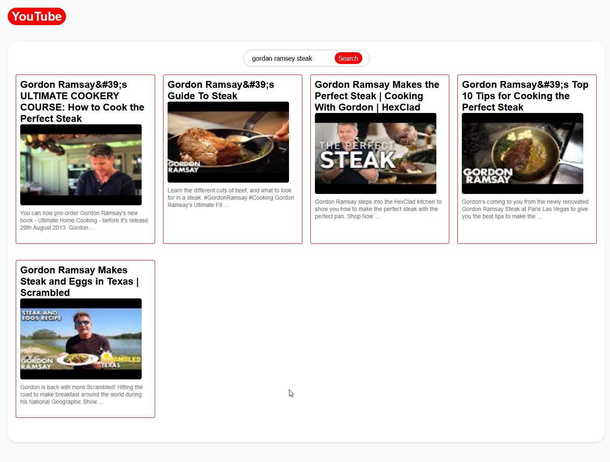

# YouTube Clone React Project

## Introduction
This project is a simplified clone of YouTube, built using React. It showcases React's capabilities in building dynamic web applications with real-time data fetching, state management, and routing.

## Getting Started

1. **Fork the Repository**: Click the 'Fork' button at the top right of this page to create a copy of this repository in your GitHub account.
2. **Clone Your Forked Repository**: Clone the repository to your local machine using the `git clone` command with your repository's URL.
3. **Navigate to Your Project Folder**: Change your directory to the folder where you cloned the repo.
4. **Install Dependencies**: Run `npm install` to install the necessary dependencies for the project.

## MVP Objectives
The Minimal Viable Product:

- **Search Bar**: Develop a search bar component to allow users to search for videos.
- **Video List**: Create a list component to display search results.
- **Video Player**: Implement a video player that plays the selected video from the list.

Three main routes to support navigation:

- **Index Route (`/`)**: The landing page displaying popular videos or a predefined set of videos.
- **Search Route (`/search`)**: Shows search results when a user performs a search using the Search Bar.
- **Video Route (`/video/:id`)**: Displays a single video and its details based on the video ID(Utilizing the :id parameter in the route path). 

## Key Components

### Home Component
- Serves as the landing page.
- Integrates a search bar for querying videos.
- Displays a list of videos based on search results or default queries.

### SearchBar Component
- Manages user input for video searches.
- Submits the search query to fetch and display relevant videos.

### VideoList Component
- Lists video thumbnails, titles, and descriptions.
- Each video item is a clickable link that directs to the video player page.

### VideoPlayer Component
- Plays the selected video. 
- Displays video details including the title and description.

## Data Fetching and Context

### Data Fetching Utilities
- **fetchData Function**: Fetches a list of videos based on the search query via the YouTube API.
    
- **getVideoById Function**: Retrieves detailed information about a specific video by ID.

### Context and State Management
- **VideoContext**: Creates a React context with a default value for videos and a function to set video data.
- **VideoProvider Component**: Manages the application's state regarding videos and makes the video data and updater function accessible to any nested components.

## Usage
- **Viewing Videos**: On the Index Route, you can view a list of popular or predefined videos.

- **Searching for Videos**: Use the Search Bar to find videos. The search results will be displayed on the Search Route.

- **Watching a Video**: Click on any video in the Video List to watch it. The Video Player will open on the Video Route, where you can view the video and its details.

## Upcoming Features
- Like/ Dislike button
- Side bar with recommended videos based on the current video 

